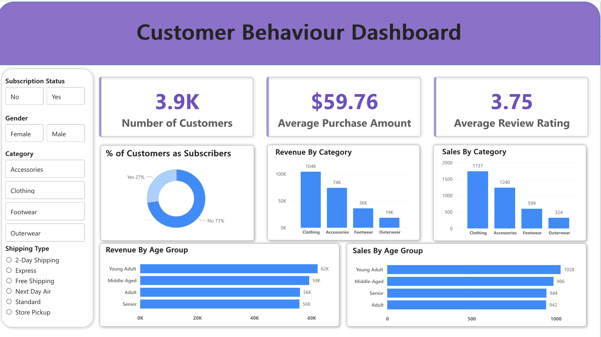

# 📊 Customer Behaviour Data Pipeline & Analytics

An end-to-end **data engineering + analytics project** that transforms raw customer shopping data into actionable business insights using **Python, MySQL, and Power BI**.

---

## 🖼️ Dashboard Preview



> Interactive Power BI dashboard showing KPIs, customer segmentation, and revenue insights.

---

## 🚀 Project Overview

This project demonstrates a complete data pipeline:

- 📥 Raw data ingestion from CSV  
- 🧹 Data cleaning & preprocessing using Python (Pandas)  
- 🗄️ Data storage and querying using MySQL  
- 📊 Interactive dashboard creation using Power BI  

The objective is to analyze **customer purchasing behavior, revenue trends, and business performance**.

---

## 🛠️ Tech Stack

- **Python (Pandas)** → Data cleaning & transformation  
- **MySQL** → Data storage & analytical queries  
- **SQLAlchemy** → Database connection  
- **Power BI** → Data visualization  
- **Jupyter Notebook** → Development environment  

---

## 📂 Project Structure

```
📦 Customer-Behaviour-Analytics
├── data/
│   └── cust_shopping_behavior.csv
├── notebooks/
│   └── project.ipynb
├── sql/
│   └── customer_behaviour.sql
├── dashboard/
│   └── customer_behaviour_dashboard.pbix
├── assets/
│   └── dashboard.png
├── README.md
```

---

## 🔄 Data Pipeline Workflow

### 1️⃣ Data Cleaning (Python)
- Handled missing values (median imputation)
- Converted data types
- Ensured data consistency and quality

---

### 2️⃣ Data Migration (MySQL)
- Created database: `customer_behaviour`
- Loaded cleaned data into SQL tables
- Used SQLAlchemy for seamless integration

---

### 3️⃣ Data Analysis (SQL)

#### 💰 Revenue by Gender
```sql
SELECT gender, SUM(purchase_amount) AS revenue
FROM customer
GROUP BY gender;
```

#### ⭐ Top Rated Products
```sql
SELECT item_purchased, ROUND(AVG(review_rating),2)
FROM customer
GROUP BY item_purchased
ORDER BY AVG(review_rating) DESC
LIMIT 5;
```

#### 🎯 Discount Effectiveness
```sql
SELECT item_purchased,
ROUND(100.0 * SUM(CASE WHEN discount_applied='Yes' THEN 1 ELSE 0 END)/COUNT(*),2)
FROM customer
GROUP BY item_purchased
ORDER BY 2 DESC
LIMIT 5;
```

More queries available in:
`sql/customer_behaviour.sql`

---

## 📊 Dashboard Features

- 📌 KPI Cards:
  - Total Customers (3.9K)
  - Average Purchase Amount ($59.76)
  - Average Rating (3.75)

- 📦 Category Analysis:
  - Revenue & sales breakdown by category

- 👥 Customer Insights:
  - Revenue by age group
  - Sales by age group

- 🎛️ Interactive Filters:
  - Gender  
  - Subscription Status  
  - Category  
  - Shipping Type  

---

## 📈 Key Insights

- Young adults generate the highest revenue  
- Clothing category dominates both revenue & sales  
- Discounts significantly influence purchasing behavior  
- Subscription status impacts customer spending patterns  

---

## ⚙️ How to Run

### 1. Clone Repository
```bash
git clone https://github.com/your-username/customer-behaviour-analytics.git
cd customer-behaviour-analytics
```

### 2. Install Dependencies
```bash
pip install pandas sqlalchemy pymysql
```

### 3. Run Notebook
```bash
jupyter notebook notebooks/project.ipynb
```

### 4. Setup Database
- Create MySQL database
- Run SQL file:
```sql
source sql/customer_behaviour.sql;
```

### 5. Open Dashboard
- Open `customer_behaviour_dashboard.pbix` in Power BI

---

## 🎯 Future Improvements

- 🚀 Automate pipeline using Airflow  
- ☁️ Deploy dashboard to cloud (Power BI Service)  
- 🤖 Add ML models for customer segmentation  
- 📡 Real-time data streaming  

---

## 👨‍💻 Author

**Aryan Srivastava**  
Aspiring Data Analyst  

---

## ⭐ If you like this project

Give it a ⭐ on GitHub — it helps a lot!
